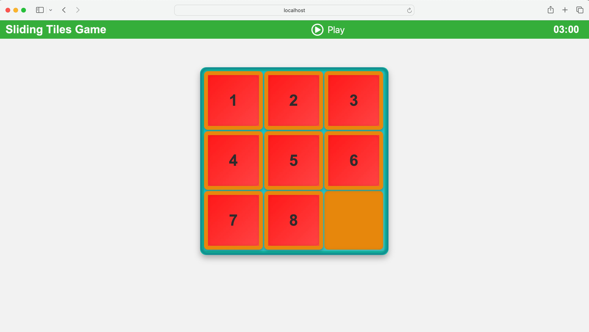

# Sliding Tiles Game

## 🎮 Game Description

**Sliding Tiles Game** is a classic puzzle built with **React**. The objective is simple yet challenging: arrange the numbered tiles in sequential order by sliding them into the empty space. Test your problem-solving skills and enjoy an engaging, responsive gaming experience across all your devices!

## Technology Stack

- **React:** Front-end library for building user interfaces.
- **Docker:** Containerization platform to ensure consistent environments.
- **Docker Compose:** Tool for defining and managing multi-container Docker applications.
- **Nginx:** Web server used to serve the built React application.
- **CSS:** Styling the game with modern and realistic design elements.

## Screenshots




## Installation & Setup

### Prerequisites

Ensure you have the following installed on your machine:

- **[Git](https://git-scm.com/)** (version 2.30 or higher)
- **[Docker](https://www.docker.com/get-started)** (version 20.10 or higher)
- **[Docker Compose](https://docs.docker.com/compose/install/)** (comes bundled with Docker Desktop)

### Clone the Repository

```bash
git clone https://github.com/shawonNirob/sliding-tiles
cd sliding-tiles
```

### Using Docker Compose

The project is containerized using Docker and managed with Docker Compose for easy setup and deployment.

#### 1. **Build and Run the Application**

Execute the following command to build the Docker images and start the containers:

```bash
docker-compose up --build
```

- **`--build`** flag ensures that Docker Compose builds the images before starting the containers.

#### 2. **Access the Application**

Once the containers are up and running, open your browser and navigate to:

```
http://localhost:3001
```

You should see the Sliding Tiles Game accessible and ready to play!

#### 3. **Stopping the Application**

To stop the running containers, press `Ctrl+C` in the terminal where Docker Compose is running. Then, execute:

```bash
docker-compose down
```

This command stops and removes the containers, networks, and other resources defined in the `docker-compose.yml`.

### Optional: Rebuild the Containers

If you make changes to the Dockerfile or want to rebuild the containers for any reason, use:

```bash
docker-compose up --build
```

## Configuration Files

### `docker-compose.yml`

Defines the Docker services for the application.

```yaml
version: '3.8'
services:
  web:
    image: sliding-tiles-game:prod
    build:
      context: .
      dockerfile: Dockerfile
    ports:
      - "3001:80"
    restart: always
```

### `Dockerfile`

Sets up the Docker image for the React application and serves it using Nginx.

```dockerfile
FROM node:16-alpine as build

WORKDIR /app

COPY package*.json ./

RUN npm install

COPY . .
RUN npm run build

FROM nginx:alpine

COPY --from=build /app/build /usr/share/nginx/html

COPY nginx.conf /etc/nginx/conf.d/default.conf

EXPOSE 80

CMD ["nginx", "-g", "daemon off;"]
```

### `nginx.conf`

Configures Nginx to serve the React application and handle routing.

```nginx
server {
    listen 80;

    # Define the root directory for the app
    root /usr/share/nginx/html;

    # Serve index.html for all requests (for React Router)
    location / {
        try_files $uri /index.html;
    }

    # Cache static files for 1 day to improve performance
    location ~* \.(js|css|png|jpg|jpeg|gif|svg|ico|ttf|woff|woff2)$ {
        expires 1d;
        add_header Cache-Control "public, max-age=86400";
    }
}
```

## Contributing

Contributions are welcome! Follow these steps to contribute:

1. **Fork the Repository**

2. **Create a Feature Branch:**

    ```bash
    git checkout -b feature/YourFeature
    ```

3. **Commit Your Changes:**

    ```bash
    git commit -m "Add Your Feature"
    ```

4. **Push to the Branch:**

    ```bash
    git push origin feature/YourFeature
    ```

5. **Open a Pull Request**


## Contact

Have questions or suggestions? Reach out to me at [LinkedIn](https://www.linkedin.com/in/shawon-sarowar/).
